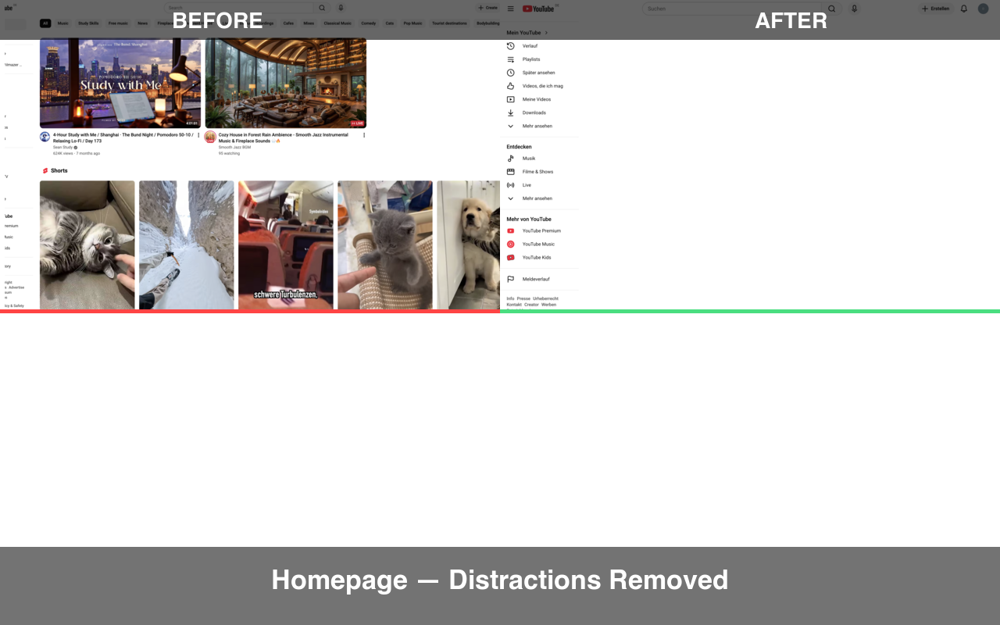
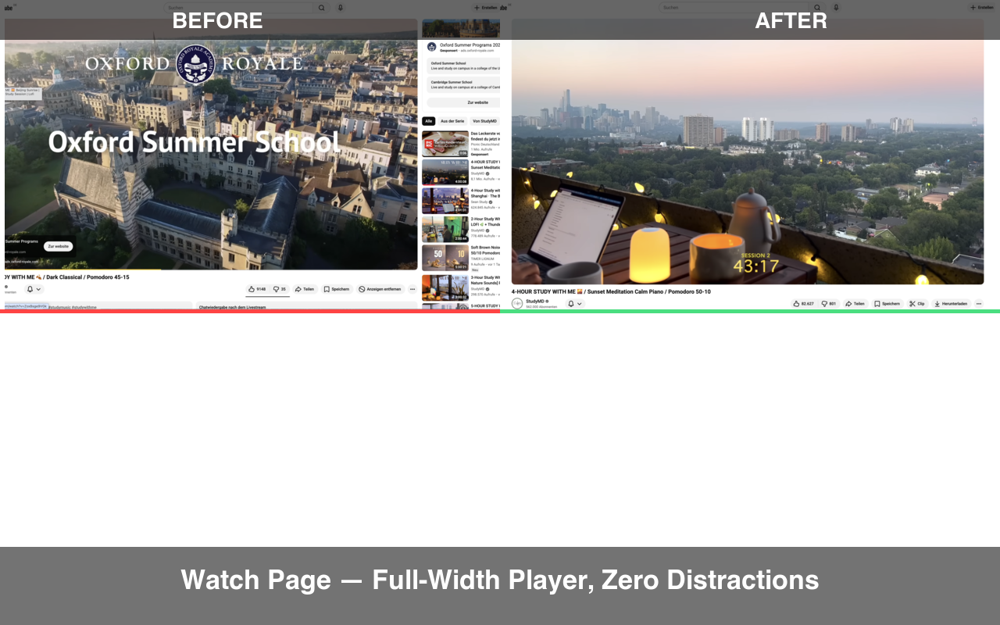
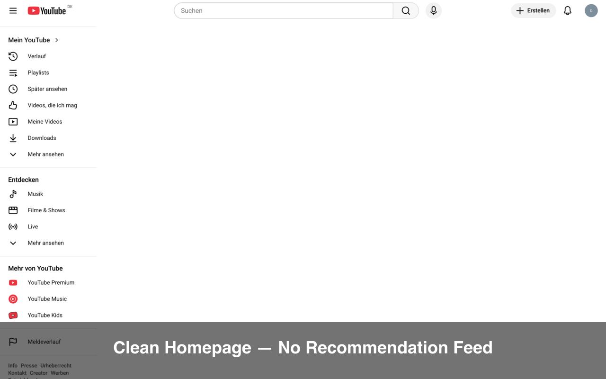
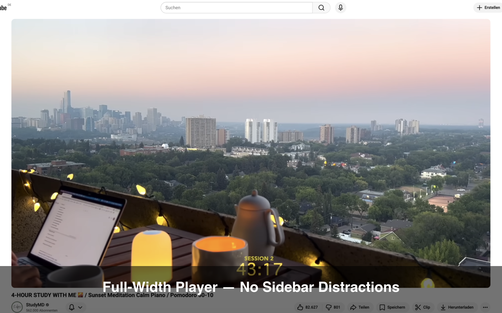
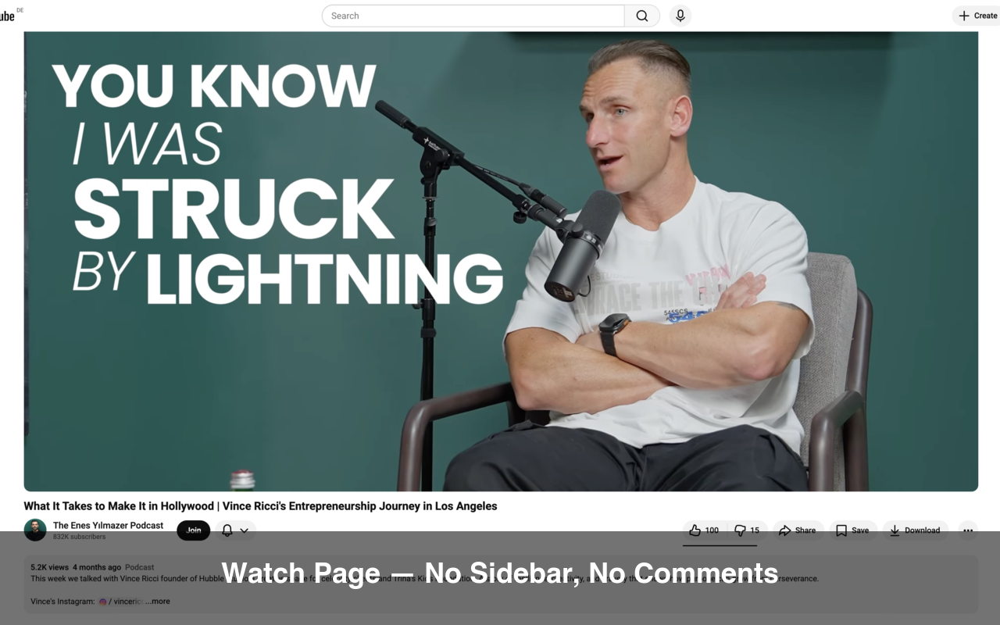
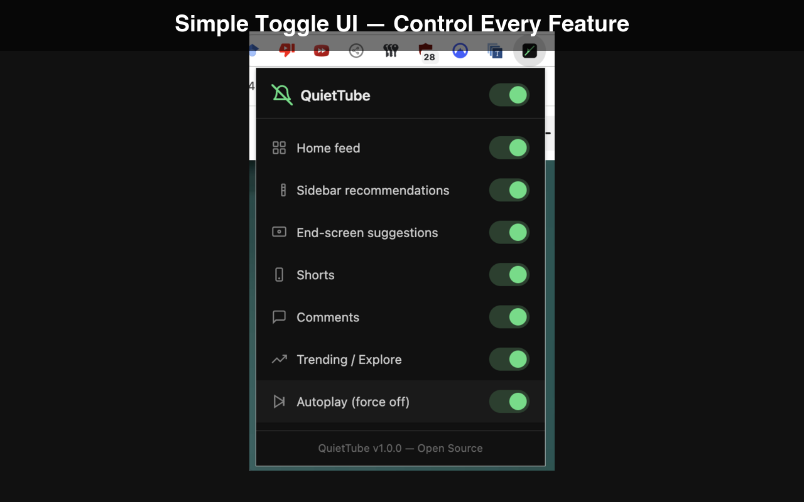

# QuietTube

**A free, open-source Chrome extension that removes distractions from YouTube.**

No ads for premium features. No time limits. No tracking. Just a clean, focused YouTube experience — forever.

---

> Tired of falling down the recommendation rabbit hole? QuietTube strips away the noise so you can watch what you came for and get back to work.

## Before & After




## Screenshots

| Clean Homepage | Full-Width Player |
|---|---|
|  |  |

| Clean Watch Page | Popup UI |
|---|---|
|  |  |

## What It Does

QuietTube hides distracting elements on YouTube using lightweight CSS injection. Every feature is individually toggleable, and there's a global kill switch to turn everything on/off instantly.

| Feature | Description |
|---|---|
| **Home Feed** | Hides the recommendation grid on the YouTube homepage |
| **Sidebar** | Removes "Up next" suggestions on watch pages and expands the video player to full width |
| **End Screen** | Hides the clickable video overlays that appear at the end of videos |
| **Shorts** | Removes Shorts everywhere — navigation, shelves, search results. Redirects `/shorts/` URLs to the normal player |
| **Comments** | Hides the entire comments section |
| **Trending / Explore** | Hides Trending and Explore pages and their sidebar links |
| **Autoplay** | Forces autoplay off and hides the toggle |

## Install

### From Source (Developer Mode)

1. Clone this repository:
   ```bash
   git clone https://github.com/dschulmeist/QuietTube.git
   ```
2. Open `chrome://extensions/` in Chrome
3. Enable **Developer mode** (top-right toggle)
4. Click **Load unpacked**
5. Select the cloned `QuietTube` folder
6. The QuietTube icon appears in your toolbar — click it to configure

### From the Chrome Web Store

*Coming soon.*

## How It Works

QuietTube is a Manifest V3 Chrome extension. It works by:

1. **Injecting CSS** (`content.css`) into YouTube pages that hides elements based on CSS classes on the `<html>` element
2. **Toggling classes** via a content script (`content.js`) that reads your preferences from `chrome.storage.sync`
3. **Providing a popup UI** (`popup.html`) where you flip switches to control which features are active

Because it's CSS-based, the performance impact is negligible — elements are hidden before they render, not removed after.

Settings sync automatically across your Chrome devices.

### Architecture

```
QuietTube/
├── manifest.json   # Chrome extension manifest (v3)
├── config.js       # Shared feature definitions and defaults
├── content.css     # CSS rules — each feature scoped behind a class
├── content.js      # Content script — applies settings, handles autoplay & Shorts redirect
├── popup.html      # Extension popup UI with toggle switches
├── popup.js        # Popup logic — reads/writes chrome.storage.sync
├── icons/          # Extension icons (16, 48, 128px)
├── LICENSE         # MIT
└── scripts/
    └── package.sh  # Builds a .zip for Chrome Web Store submission
```

## YouTube DOM Changes

YouTube periodically updates their DOM structure, which can break CSS selectors. If a feature stops working, the fix is almost always updating a selector in `content.css`. Issues and PRs are welcome.

## Contributing

1. Fork the repository
2. Create a feature branch (`git checkout -b feature/my-feature`)
3. Make your changes
4. Test by loading the unpacked extension in Chrome
5. Submit a pull request

## License

[MIT](LICENSE) — use it however you want.
